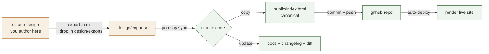
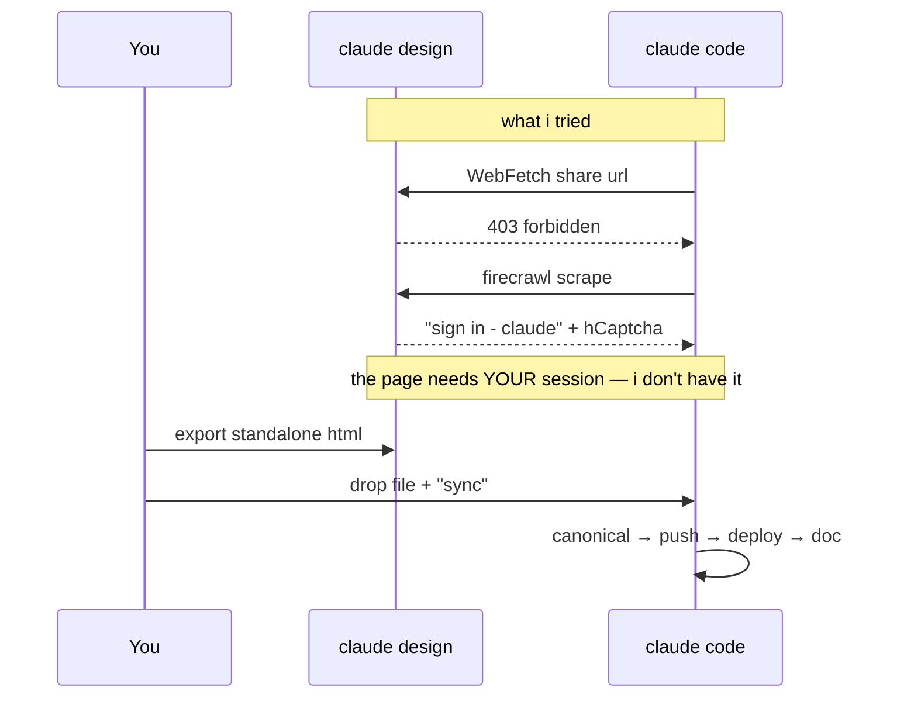

# concierge — how design, code and live stay in sync

plain-language first: you plan the design in **claude design**, and we want that to end up
**live** and **documented** without you babysitting it. the catch is claude design is locked
behind your login, so nothing i run can reach in and grab it. so we put one small manual hop in
the loop — you export the file — and automate literally everything after that.

the shape of it:

- **you author** in claude design (plan, wireframe, iterate there — that's where you like to think)
- **one hop**: export the standalone html → drop it in `design/exports/` → say "sync"
- **i automate the rest**: canonical file, git history, render deploy, docs, diffs

that's the whole deal. one file-drop per design pass buys you version history + a live url + real docs.

---

## the technical side

### the flow

the orange boxes are the only thing you touch. everything green is automatic.

### why there's a manual hop at all

### pieces / choices

| piece | choice now | why | later / alternative |
| --- | --- | --- | --- |
| source of truth | `public/index.html` in git | one file, versioned, diffable | could split into components if the page grows |
| author surface | claude design | it's where you plan/wireframe | could author directly in-repo (lose the design canvas) |
| design → repo | **manual export + drop** | claude design is auth-gated; no api/webhook | if claude ships an export api, automate the pull |
| repo → live | render static site, auto-deploy on push | already wired, zero-touch | netlify/vercel/cf-pages equivalent |
| what's public | only `public/` (publishPath=public) | keep planning docs off the public url | password-protect the whole thing if needed |
| changelog | git history | free, precise, per-revision | add a human CHANGELOG.md if you want prose |

### optional automation i can add

- a **folder-watch**: watch `design/exports/` and auto-run the sync the moment you drop a file, so
  your side is just "drop" (no need to even say "sync"). trade-off: a background watcher process.
- a **diff view**: after each sync, i render a side-by-side of what changed vs the previous export.

---

## decisions to talk about

1. **same repo or separate?** — right now planning docs + the deployed site live in one repo
   (`concierge-wireframe`). one source of truth, but the repo is public. ok, or split?
2. **public repo** — it's public so render builds it cleanly. want it private instead
   (i'd confirm render's github app has access first)?
3. **the folder-watch** — want the "drop and it just deploys" watcher, or keep the explicit
   "sync" word as the trigger?
4. **is claude design really the home?** — if you'd rather plan *in the repo* (house-style .md/.html
   twins, which i can pull/push freely), we drop the manual hop entirely — but you lose the design canvas.
